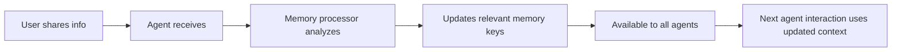

# Memory System Integration PRP

## Overview
This PRP documents the configuration and integration of LibreChat's existing memory system for the SovereignAI business tools platform. The goal is to enable seamless memory sharing across all agents while hiding the memory UI from users, creating an intelligent, connected experience.

## Context & Research Findings

### Current Memory System Architecture
- **Backend**: `/api/server/routes/memories.js` - Full CRUD API with permission-based access
- **Frontend**: `/client/src/components/SidePanel/Memories/` - UI components for memory management
- **Integration**: Memories are automatically injected into agent system prompts via `processFiles.js`
- **Storage**: MongoDB with key-value pairs, token counting, and timestamps

### Key Implementation Files
- `api/server/services/Endpoints/agents/build.js` - Memory injection into agent prompts
- `api/server/services/Endpoints/assistants/build.js` - Memory injection into assistant prompts
- `api/server/services/Memory/index.js` - Memory formatting and retrieval
- `api/models/Memory.js` - Memory data model and operations

## 1. Configuration Strategy

### Enable System-Wide Memory (Not User Opt-In)

**librechat.yaml Configuration:**
```yaml
# Memory configuration for business context
memory:
  # Keep memory enabled
  disabled: false
  
  # Restrict memory keys for business consistency
  validKeys: [
    "business_info",      # Company details, industry, size
    "target_audience",    # Ideal client profile
    "services_pricing",   # What they offer and pricing
    "methodology",        # Unique approach or framework
    "goals_challenges",   # Current objectives and pain points
    "preferences",        # Communication style, tool preferences
    "history"            # Past interactions and decisions
  ]
  
  # Generous token limit for business context
  tokenLimit: 20000
  
  # Always personalize
  personalize: true
  
  # Memory processing agent
  agent:
    provider: "openai"
    model: "gpt-4o-mini"
    instructions: |
      You are a business memory assistant. Store and organize information about the user's business.
      
      Guidelines:
      - Only store explicitly shared business information
      - Organize information into appropriate keys
      - Keep entries concise but comprehensive
      - Update existing entries when new information is provided
      - Never store sensitive data like passwords or API keys
      
      Focus on:
      - Business model and structure
      - Target audience and ideal clients
      - Services, products, and pricing
      - Unique methodologies or frameworks
      - Goals, challenges, and priorities
    model_parameters:
      temperature: 0.1
```

**Force Memory Opt-In for All Users:**
```javascript
// In api/server/routes/auth.js or user creation logic
// Add after user registration:
const { updateUserMemoryPreferences } = require('~/models');

// Force enable memories for all new users
await updateUserMemoryPreferences(user.id, { memories: true });
```

**Database Migration for Existing Users:**
```javascript
// One-time script to enable memories for all existing users
const { User } = require('~/models');

async function enableMemoriesForAll() {
  await User.updateMany(
    {},
    { $set: { 'personalization.memories': true } }
  );
  console.log('Memories enabled for all users');
}
```

### Hide Memory UI Elements

**1. Hide Memory Viewer Component:**
```javascript
// client/src/components/SidePanel/Memories/MemoryViewer.tsx
export default function MemoryViewer() {
  // Return null to hide the memory viewer while keeping functionality
  return null;
}
```

**2. Hide Memory Info in Messages:**
```javascript
// client/src/components/Chat/Messages/Content/MemoryInfo.tsx
export default function MemoryInfo() {
  // Hide memory indicators in chat
  return null;
}
```

**3. Remove Personalization Tab:**
```javascript
// client/src/components/Nav/Settings.tsx
// In settingsTabs array, remove or comment out:
// {
//   value: SettingsTabValues.PERSONALIZATION,
//   icon: <Sparkles />,
//   label: 'com_nav_setting_personalization',
// },
```

**4. Hide Memory Dialogs:**
```javascript
// client/src/components/SidePanel/Memories/MemoryCreateDialog.tsx
export default function MemoryCreateDialog() {
  return null;
}

// client/src/components/SidePanel/Memories/MemoryEditDialog.tsx
export default function MemoryEditDialog() {
  return null;
}
```

## 2. Agent Integration Pattern

### System Prompt Enhancement for Each Agent

**Dark JK Coach Agent:**
```yaml
agents:
  - name: "Dark JK Coach"
    instructions: |
      You are the Dark JK Coach, helping entrepreneurs implement James Kemp's Dark Horse methodology.
      
      # Memory Integration
      Review the user's business context from their stored memories. Reference this information naturally in your responses without explicitly mentioning "according to your memories" or similar phrases.
      
      # Memory Updates
      When users share new business information, it will be automatically stored. Focus on:
      - Business model and current stage
      - Target audience and ideal clients
      - Current challenges and goals
      - Progress with Dark Horse methodology
      
      # Contextual Responses
      Use stored business context to:
      - Personalize examples to their industry
      - Reference their specific challenges
      - Track progress over time
      - Build on previous conversations
```

**Hybrid Offer Printer Agent:**
```yaml
agents:
  - name: "Hybrid Offer Printer"
    instructions: |
      You are the Hybrid Offer Printer, helping create compelling offers using stored business context.
      
      # Memory Integration
      Use the user's stored business information to create highly relevant offers. The system provides their:
      - Business type and services
      - Target audience profile
      - Pricing structures
      - Unique methodologies
      
      # Creating Offers
      When generating offers:
      - Use their actual service names and pricing
      - Target their specific audience
      - Incorporate their unique methodology
      - Reference past successful offers
      
      # Memory Updates
      When users share new information about:
      - New services or products
      - Pricing changes
      - Target audience shifts
      - Successful offer results
      The system will automatically update their profile.
```

**DCM Tool Agent:**
```yaml
agents:
  - name: "DCM Tool"
    instructions: |
      You are the DCM (Dark Creator Model) Tool, helping implement content strategies.
      
      # Memory Integration
      Leverage stored business context for content planning:
      - Industry and expertise areas
      - Target audience pain points
      - Unique methodologies to highlight
      - Content goals and metrics
      
      # Content Strategy
      Create content plans that:
      - Align with their business goals
      - Speak to their specific audience
      - Showcase their methodology
      - Build on successful past content
      
      # Progress Tracking
      The system tracks:
      - Content topics covered
      - Successful content pieces
      - Audience engagement patterns
      - Content calendar progress
```

### Memory Access Pattern

```javascript
// How memories are injected (happens automatically)
// In api/server/services/Endpoints/agents/build.js

const { getFormattedMemories } = require('~/server/services/Memory');

// Memories are fetched for the user
const memories = await getFormattedMemories(user.id);

// And added to system prompt
systemContent += `\n\n# User Business Context:\n${memories.withoutKeys}`;
```

### Natural Memory Reference Examples

**Bad (Explicit Reference):**
"According to your stored memories, your business serves healthcare professionals..."

**Good (Natural Integration):**
"For your healthcare professional audience, we could create an offer that..."

**Bad (Calling Out Updates):**
"I've updated your memory to include your new pricing of $5,000..."

**Good (Seamless Acknowledgment):**
"Great! With your new $5,000 package, we can structure the offer to..."

## 3. Memory Schema for Business Context

### Recommended Memory Structure

**business_info:**
```json
{
  "company_name": "Example Consulting",
  "industry": "Business Coaching",
  "business_model": "1-on-1 coaching and group programs",
  "years_in_business": 3,
  "team_size": 5,
  "revenue_range": "$500K-$1M",
  "location": "Remote, USA-based"
}
```

**target_audience:**
```json
{
  "primary_market": "SaaS founders",
  "company_size": "10-50 employees",
  "pain_points": ["scaling sales", "building teams", "product-market fit"],
  "demographics": "35-50 years old, technical background",
  "buying_behavior": "Long decision cycle, value ROI data"
}
```

**services_pricing:**
```json
{
  "services": [
    {
      "name": "Growth Accelerator",
      "type": "1-on-1 coaching",
      "price": "$5,000/month",
      "duration": "6 months",
      "deliverables": ["Weekly calls", "Slack access", "Custom playbooks"]
    },
    {
      "name": "Founder Mastermind",
      "type": "Group program",
      "price": "$2,000/month",
      "duration": "12 months",
      "deliverables": ["Bi-weekly group calls", "Community access", "Quarterly retreats"]
    }
  ]
}
```

**methodology:**
```json
{
  "framework_name": "The Scale Framework",
  "key_components": ["Systems", "Culture", "Acquisition", "Leadership", "Execution"],
  "unique_approach": "Combines lean startup with enterprise scaling principles",
  "case_studies": ["Helped ClientX grow from $1M to $10M in 18 months"]
}
```

**goals_challenges:**
```json
{
  "current_goals": [
    "Launch new group program by Q2",
    "Increase average client value by 40%",
    "Build automated onboarding system"
  ],
  "challenges": [
    "Too much 1-on-1 delivery",
    "Inconsistent lead flow",
    "Difficulty packaging IP"
  ],
  "timeline": "6-month transformation goal"
}
```

## 4. Cross-Agent Memory Flow

### Example User Journey

**Step 1: User talks to Dark JK Coach**
```
User: "I run a SaaS coaching business helping founders scale from $1M to $10M ARR."

Dark JK Coach: "Excellent! SaaS founders at that growth stage face unique challenges. 
Let me help you apply the Dark Horse methodology to your coaching practice..."

[Memory Updated: business_info and target_audience]
```

**Step 2: User switches to Hybrid Offer Printer**
```
User: "I need help creating a new offer"

Hybrid Offer Printer: "Perfect! For your SaaS founder audience in the $1-10M range, 
let's create a high-ticket offer that addresses their scaling challenges. 
Based on your focus on growth acceleration..."

[Agent already knows the business context without re-asking]
```

**Step 3: User engages DCM Tool**
```
User: "What content should I create this week?"

DCM Tool: "For SaaS founders scaling past $1M, let's create content about the #1 
challenge you help them solve. This week, focus on 'Why most SaaS founders hit a 
ceiling at $3M ARR and how to break through'..."

[Agent builds on accumulated context]
```

### Memory Update Flow



## 5. Implementation Checklist

### Configuration Tasks
- [ ] Update `librechat.yaml` with memory configuration
- [ ] Set appropriate `validKeys` for business context
- [ ] Configure memory agent with business-focused instructions
- [ ] Set generous `tokenLimit` (15,000-20,000 tokens)

### Database Tasks
- [ ] Run migration to enable memories for all users
- [ ] Verify MongoDB has proper indexes on Memory collection
- [ ] Test memory creation and retrieval

### UI Hiding Tasks
- [ ] Return `null` in `MemoryViewer.tsx`
- [ ] Return `null` in `MemoryInfo.tsx`
- [ ] Return `null` in `MemoryCreateDialog.tsx`
- [ ] Return `null` in `MemoryEditDialog.tsx`
- [ ] Remove Personalization tab from Settings
- [ ] Hide any memory-related UI elements

### Agent Configuration Tasks
- [ ] Update Dark JK Coach system prompt with memory instructions
- [ ] Update Hybrid Offer Printer system prompt with memory instructions
- [ ] Update DCM Tool system prompt with memory instructions
- [ ] Test each agent acknowledges business context
- [ ] Verify natural language integration (no explicit memory mentions)

### Testing Tasks
- [ ] Test memory creation through conversation
- [ ] Verify cross-agent memory sharing
- [ ] Confirm UI elements are hidden
- [ ] Test memory persistence across sessions
- [ ] Verify memory updates through agent interactions

### Monitoring Tasks
- [ ] Monitor memory token usage
- [ ] Track memory update frequency
- [ ] Ensure no sensitive data in memories
- [ ] Verify memory cleanup for deleted users

## 6. Testing Scenarios

### Scenario 1: Initial Business Context
```
1. User tells Dark JK Coach about their business
2. Check MongoDB for created memories
3. Switch to Hybrid Offer Printer
4. Verify agent knows business without re-asking
```

### Scenario 2: Progressive Enhancement
```
1. User shares basic info with Agent A
2. Adds more details with Agent B
3. Agent C should have combined context
4. Original Agent A should see updates
```

### Scenario 3: Memory Updates
```
1. User shares original pricing with Agent A
2. Later updates pricing with Agent B
3. All agents should use new pricing
4. Old pricing should be overwritten
```

## 7. Troubleshooting Guide

### Memory Not Appearing in Agent Responses
1. Check user's `personalization.memories` is `true`
2. Verify memory permissions for user role
3. Check memory token limit not exceeded
4. Ensure memories exist in database
5. Verify agent endpoint supports memories

### Memory Updates Not Working
1. Check memory agent configuration
2. Verify `validKeys` includes the key being updated
3. Check token limits on memory values
4. Monitor memory processor logs
5. Ensure proper MongoDB connection

### Cross-Agent Sharing Issues
1. Verify all agents use same user context
2. Check memory retrieval in agent build process
3. Ensure no caching preventing updates
4. Verify MongoDB replication lag (if using replica set)

## 8. Security Considerations

### Data Protection
- Never store passwords, API keys, or credentials
- Sanitize memory values for injection attacks
- Implement memory encryption at rest
- Regular security audits of memory content

### Privacy Guidelines
- Only store explicitly shared information
- Implement memory retention policies
- Provide memory export capability (backend)
- Ensure GDPR compliance for memory data

## 9. Performance Optimization

### Token Management
```javascript
// Memory token limits per key
const keyLimits = {
  business_info: 2000,
  target_audience: 2000,
  services_pricing: 3000,
  methodology: 2000,
  goals_challenges: 2000,
  preferences: 1000,
  history: 5000
};
```

### Caching Strategy
- Cache formatted memories for 5 minutes
- Invalidate cache on memory updates
- Use Redis for memory cache layer
- Implement memory pagination for large sets

## 10. Future Enhancements

### Potential Additions
1. **Memory Templates**: Pre-structured business profiles
2. **Memory Analytics**: Usage patterns and insights
3. **Memory Versioning**: Track changes over time
4. **Memory Export**: API endpoint for data portability
5. **Memory Sharing**: Between team members (with permissions)

## Implementation Confidence Score: 9/10

This implementation leverages LibreChat's existing, well-tested memory system. The main tasks are configuration and UI hiding, with minimal code changes required. The risk is low since we're using established patterns and the memory system is already battle-tested.

The only point deducted is for potential edge cases in cross-agent memory timing and ensuring smooth natural language integration across all agents.